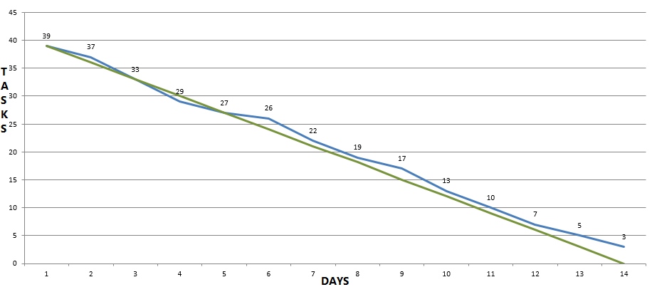

**Team 8 Workspace**

**Required:** JDK 1.8 version installed.

**Project 5 update:**
- Added # pound shape to top and left panel with double click input function.
- Ability to change the workspace i.e. maximise, minimise and resize for better viewing.
- Added shapes and functionality to display them on top and left hand side and create those shapes in the workspace.
- File Menu and Project Menu created to open new workspaces and to compile and translate.
- Enabled the functionality to name a new tab and work with different tabs.
- Functionality to delete or change links between shapes was implemented.
- Implemented translate shapes to code to enable creation of general structural graphs.

<a href="https://github.com/SER516-S20/ProjectFive/blob/master/Team_08/doc/STAN%20-%20Quality%20Report.pdf" target="_blank">STAN Quality Report.</a>

<a href="https://github.com/SER516-S20/ProjectFive/blob/master/Team_08/doc/Project%205%20Documentation.pdf" target="_blank"> Project 5 Documentation </a>

**Burndown for Project 5:**

